# AWS VPC, EC2 & Amazon S3 Integration using AWS CLI

## 📖 Project Overview

In this hands-on AWS project, I created a custom Virtual Private Cloud (VPC), launched an Amazon EC2 instance inside a public subnet, configured AWS CLI authentication using IAM Access Keys, and successfully interacted with an Amazon S3 bucket from the EC2 instance.

This project helped me understand how networking, compute, identity, and storage services work together in AWS.

---

## 🏗️ Architecture

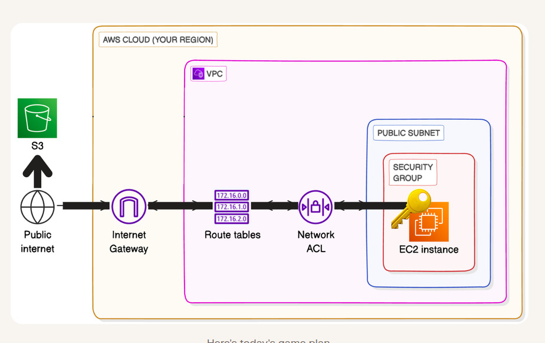

---

## ☁️ AWS Services Used

- Amazon VPC
- Public Subnet
- Internet Gateway
- Route Table
- Security Group
- Amazon EC2
- AWS CLI
- IAM
- Amazon S3

---

# 🚀 Project Implementation

## Step 1 - Create a Custom VPC

I created a custom VPC using the **VPC and More** wizard with:

- 1 Availability Zone
- 1 Public Subnet
- 0 Private Subnets

### VPC

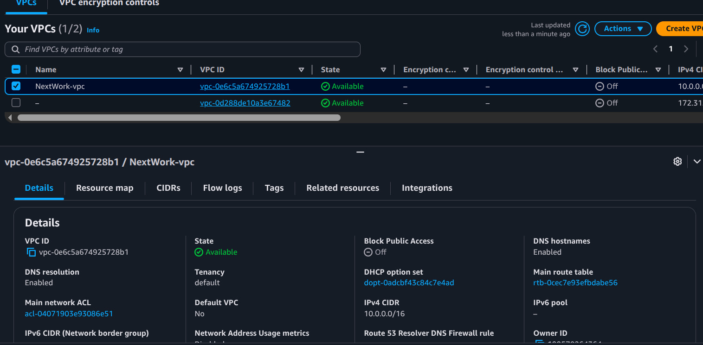

### Public Subnet

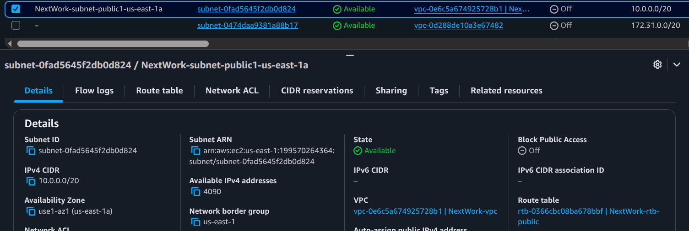

### Internet Gateway

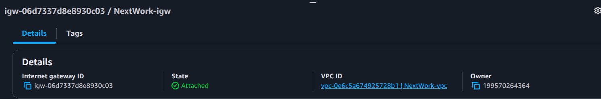

### Route Table

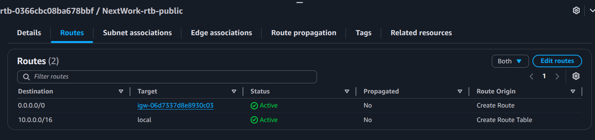

### Security Group

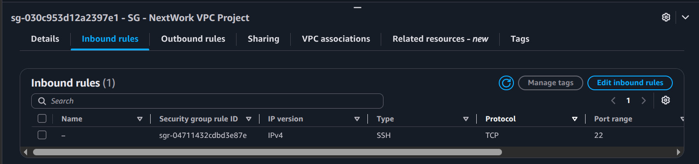

---

## Step 2 - Launch an EC2 Instance

I launched an Amazon Linux EC2 instance inside the public subnet and attached the custom security group.

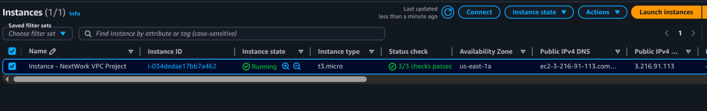

---

## Step 3 - Connect to EC2

I connected to the EC2 instance using **EC2 Instance Connect** directly from the AWS Console.

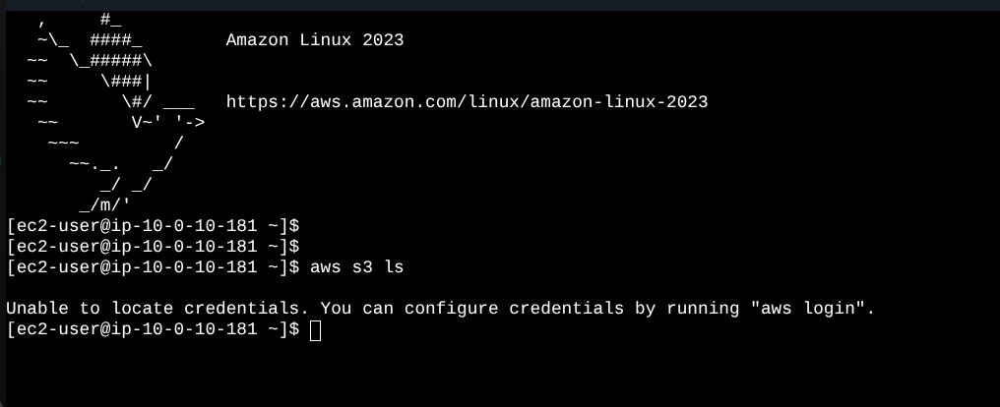

---

## Step 4 - Test Amazon S3 Access

Before configuring AWS CLI credentials, I tested S3 access.

Command:

```bash
aws s3 ls
```

The command failed because no AWS credentials were configured.

This helped me understand that an EC2 instance cannot automatically access AWS resources without authentication.

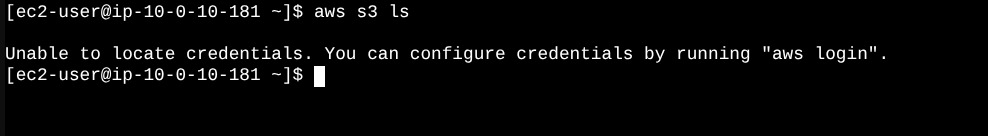

---

## Step 5 - Configure AWS CLI

I configured the AWS CLI using IAM Access Keys.

Command:

```bash
aws configure
```

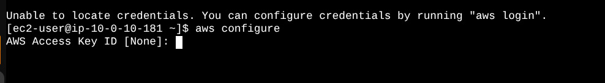

---

## Step 6 - Create an Amazon S3 Bucket

I created an S3 bucket and uploaded two sample files.

---

## Step 7 - Verify Bucket Access

After configuring AWS CLI, I verified that the EC2 instance could communicate with Amazon S3.

Command:

```bash
aws s3 ls
```

Output:

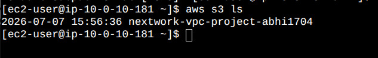

---

## Step 8 - List Bucket Contents

Command:

```bash
aws s3 ls s3://nextwork-vpc-project-abhi1704
```

Output:

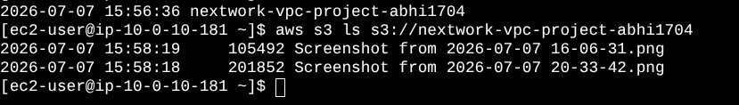

---

## Step 9 - Upload a File from EC2 to S3

I created an empty file inside the EC2 instance.

```bash
sudo touch /tmp/test.txt
```

Then uploaded it to Amazon S3.

```bash
aws s3 cp /tmp/test.txt s3://nextwork-vpc-project-abhi1704
```

Finally, I verified that the upload was successful.

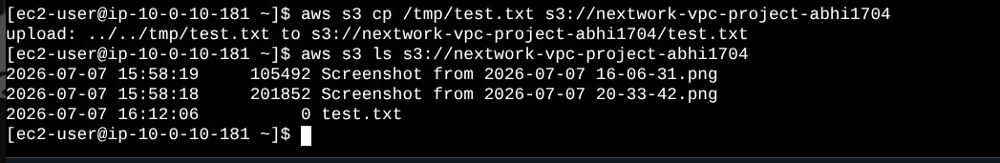

---

# 💻 AWS CLI Commands Used

```bash
aws s3 ls

aws configure

aws s3 ls s3://nextwork-vpc-project-abhi1704

sudo touch /tmp/test.txt

aws s3 cp /tmp/test.txt s3://nextwork-vpc-project-abhi1704

aws s3 ls s3://nextwork-vpc-project-abhi1704
```

---

# ⚠️ Challenge Faced

Initially, the EC2 instance was unable to access Amazon S3 because AWS CLI credentials had not been configured.

After creating IAM Access Keys and running:

```bash
aws configure
```

the EC2 instance successfully authenticated and accessed the S3 bucket.

---

# 📚 Key Learnings

- Creating a custom Amazon VPC
- Understanding Public Subnets
- Configuring Internet Gateways
- Working with Route Tables
- Creating Security Groups
- Launching Amazon EC2
- Connecting using EC2 Instance Connect
- Configuring AWS CLI
- IAM Access Key authentication
- Managing Amazon S3 buckets
- Uploading files to Amazon S3 using AWS CLI

---

# 🎯 Skills Demonstrated

- AWS Networking
- Amazon VPC
- Amazon EC2
- Amazon S3
- IAM
- AWS CLI
- Linux Commands
- Cloud Troubleshooting
- Infrastructure Deployment

---

## ✅ Project Status

**Completed Successfully**

✔ Custom VPC Created

✔ EC2 Instance Deployed

✔ AWS CLI Configured

✔ Amazon S3 Connected

✔ File Uploaded Successfully

---

## 👨‍💻 Author

**Abhijith Babu**

Learning AWS Cloud through hands-on projects and building a cloud portfolio on GitHub.
